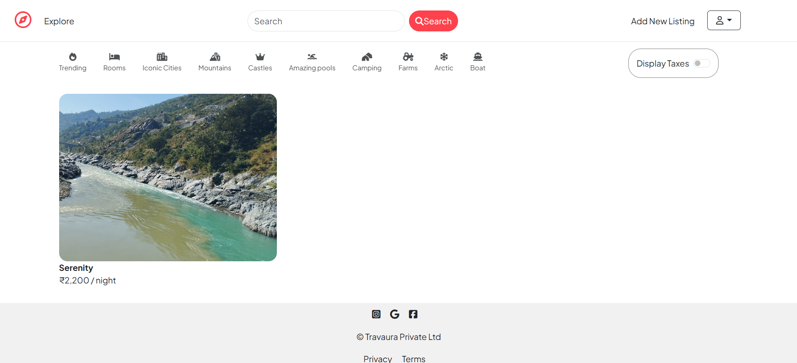

# 🌍 Travaura

Travaura is a modern travel planning web application designed to make trip organization seamless. Easily manage your travel listings, explore destinations on interactive maps, upload images, and plan collaboratively.

---

## 🚀 Live Demo

👉 [Click here to explore Travaura](https://travaura-3pfr.onrender.com)

---

## 🧰 Tech Stack

- **Frontend:** HTML, CSS, JavaScript, EJS
- **Backend:** Node.js, Express.js
- **Database:** MongoDB (Mongoose)
- **Templating:** EJS
- **Image Hosting:** Cloudinary
- **Maps:** Leaflet.js
- **Deployment:** Render

---

## 📦 Features

- 🧭 Add, edit, and delete travel listings
- 🗺️ View each listing's location on an interactive Leaflet map
- 📍 Automatic geocoding of location names into coordinates
- 📷 Upload images to Cloudinary
- 🧾 Flash messaging for user feedback
- 🔒 Secure sessions using environment variables
- 🌐 Deployed on Render for public access

---

## 🛠️ Environment Variables Setup

Create a `.env` file in the root directory and add the following:

```env
CLOUD_NAME=your_cloudinary_cloud_name
CLOUD_API_KEY=your_cloudinary_api_key
CLOUD_API_SECRET=your_cloudinary_api_secret

Atlas_URL=your_mongodb_connection_string
SECRET=your_session_secret
```

> ⚠️ **Note:** Make sure `.env` is listed in your `.gitignore` file.

---

## 🖥️ Getting Started (Local Development)

```bash
# Clone the repository
git clone https://github.com/Vatsal-patel7/Travaura

# Navigate to the project folder
cd Travaura

# Install all dependencies
npm install

# Create a .env file and fill in your environment variables

# Start the development server
npm start
```

Visit `http://localhost:3000` in your browser.

---

## 📁 Folder Structure

```
Travaura/
├── controllers/         # Route logic and handlers
├── models/              # Mongoose schemas
├── public/              # Static files (JS, CSS)
│   ├── js/
│   └── css/
├── routes/              # Express route definitions
├── utils/               # Utility functions (e.g., geocoding)
├── views/               # EJS templates
│   ├── partials/
│   └── listings/
├── .env                 # Environment variables (do not commit)
├── app.js               # Main server entry point
├── package.json
└── README.md
```

---

## 🖼️ Screenshots

### 🏠 Home Page


### 📝 Listing Form


### 🗺️ Map Integration


---

## 🤝 Contributing

Contributions are welcome!

```bash
# Fork the repo and create a new branch
git checkout -b feature-name

# Make your changes, then commit
git commit -m "Add some feature"

# Push and open a pull request
git push origin feature-name
```

---

## 📃 License

This project is licensed under the [MIT License](https://opensource.org/licenses/MIT).

---

## ✨ Credits

Made with ❤️ by [Vatsal Patel](https://github.com/Vatsal-patel7)
